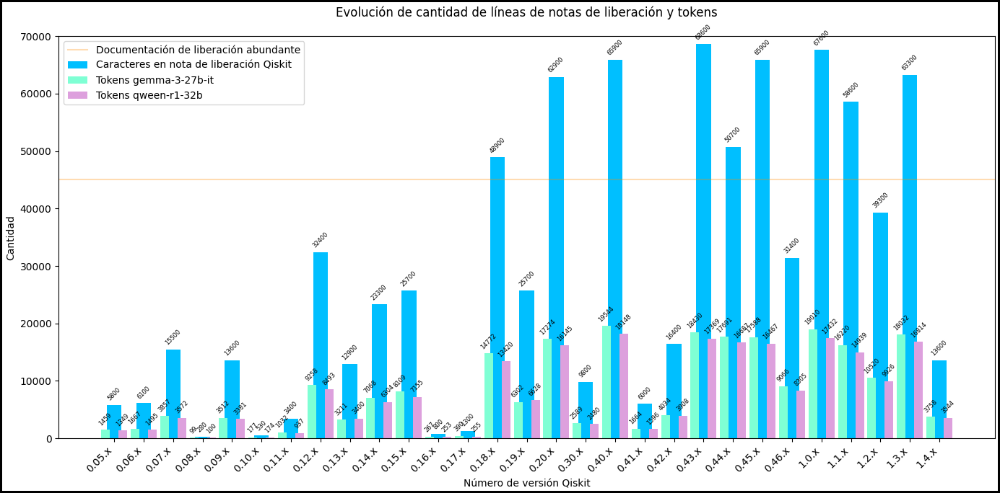
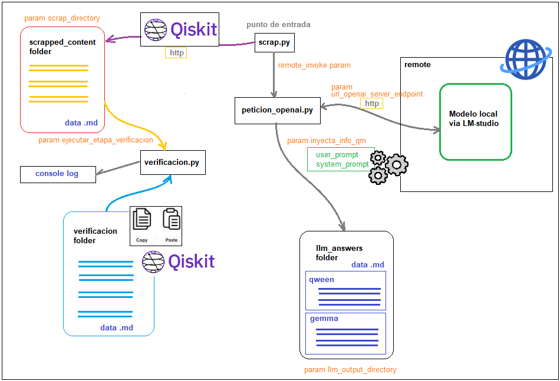

## Información de ejecución del proyecto

Ejemplo de ejecución del comando:

```python
python ./scrap.py --version "0.46" --invoke_openai true --url_openai_server_endpoint "http://dominio.com:puerto/subdominio" --openai_api_key "modelo" --verificacion true
```

## Estructura del proyecto

Este proyecto se estructura en diferentes secciones específicas:
	
- **/llm_answers**
	- Directorio de almacenamiento de respuestas obtenidas de los modelos
	- **/modelo_llm**
    	- Directorio de respuestas específica de cada modelo
	- **/version**
    	- Directorio específico de versión consultada
	- **/metadata**
    	- Directorio de almacén de datos de solicitudes y respuestas

- **/scraped_content**
	- Archivos markdown con documentación de qiskit release notes descargados desde el sitio oficial

- **/**verificacion**
	- Archivos con información comparativa y de comprobación para evaluar diferencias con el sitio oficial

- **peticion_openapi**.**py**
	- Script python de invocación al servicio de OpenAI, DeepSeek o servicios almacenados remotamente

- **scrap**.**py**
	- Script principal del proyecto, inicializa las etapas a partir de la parametrización inicial

- **verificacion**.**py**
	- Script de comparación entre archivos de versión en /verificacion y en /scraped_content

- **utils.py**
    - Script con funcionalidad útil 

## Configuración de variables de entorno

Configurando el archivo de variables de entorno del proyecto (.env), no es necesario enviar ningún parámetro.
Ejemplo de configuración (archivo .env):

```python
	# Indica el endpoint de conexión remota
	URL_OPENAI_SERVER_ENDPOINT="http://prueba.com:80/subdominio"

	# Indica la key de conexión a la api
	OPENAI_API_KEY="api-key"

	# Indica el nombre de modelo LLM a utilizar
	MODEL="LLM_model"

	# Indica el directorio donde se guardan las respuestas de invocaciones remotas
	MODEL_OUTPUT_DIRECTORY="llm_answers"

	# Indica el directorio donde se guardan las recopilaciones de info de qiskit release notes
	SCRAP_DIRECTORY="scraped_content"

	# Indica si al prompt enviado al modelo se le inyecta información recopilada desde Qiskit release notes
	INYECTA_INFO_QRN=True
	
	# Indica si se realizará la invocación remota
	REMOTE_INVOKE=True

	# Indica la versión de qiskit para la generación de la tabla
	DEFAULT_VERSION="0.25"

	# Indica la temperatura del modelo (0 menos grados de libertad)
	TEMPERATURE=0

	# Indica si ejecutar o no una etapa de verificación de la info del release note, con la copiada desde esa url
	EJECUTAR_ETAPA_VERIFICACION=False
```

## Información de tokens y caracteres de las notas de liberación

	- prompt de sistema:
    	- 5650 caracteres aprox.
    	- 1300 tokens aprox.
  
	- prompt de usuario:
    	- 1760 caracteres aprox.
    	- 384 tokens aprox.

  	- A priori, los prompts sin información añadida rondan:
    	- 7410 caracteres aprox.
    	- 1684 tokens aprox.


| Version  |  Tamaño  | Cant. líneas | Cant. líneas no vacías | Cant. lineas dif. | Cant. caracteres (k) |Cant. diferencias | estabilidad de datos | # tokens Gemma | # tokens Qween |
| -------: | :------: | -----------: | ---------------------: | ----------------: | -------------------: | ---------------: | :------------------: | -------------: | -------------: |
| 0.05.x | pequeño | 100 | 65 | 64 | 5.8 | 0 | alta | 1459 | 1349 |
| 0.06.x | pequeño | 114 | 79 | 25 | 6.1 | 0 | alta | 1667 | 1495 |
| 0.07.x | moderado | 183 | 127 | 103 | 15.5 | 0 | alta | 3857 | 3572 |
| 0.08.x | pequeño | 12 | 9 | 3 | .28 | 0 | alta | 99 | 100 |
| 0.09.x | moderado | 156 | 141 | 54 | 13.6 | 0 | alta | 3512 | 3381 |
| 0.10.x | pequeño | 22 | 17 | 1 | .53 | 0 | alta | 177 | 174 |
| 0.11.x | pequeño | 83 | 57 | 28 | 3.4 | 0 | alta | 1032 | 937 |
| 0.12.x | moderado | 745 | 330 | 28 | 32.4 | 1 | alta | 9258 | 8493 |
| 0.13.x | moderado | 243 | 168 | 7 | 12.9 | 0 | alta | 3211 | 3400 |
| 0.14.x | moderado | 370 | 269 | 566 | 23.3 | 0 | alta | 7068 | 6304 |
| 0.15.x | moderado | 335 | 254 | 218 | 25.7 | 1 | alta | 8109 | 7155 |
| 0.16.x | pequeño | 20 | 15 | 1 | .8 | 0 | alta | 267 | 253 |
| 0.17.x | pequeño | 25 | 20 | 2 | 1.3 | 0 | alta | 390 | 355 |
| 0.18.x | grande | 857 | 598 | 158 | 48.9 | 2 | alta | 14772 | 13420 |
| 0.19.x | moderado | 322 | 246 | 53 | 25.7 | 2 | alta | 6302 | 6628 |
| 0.20.x | grande | 766 | 537 | 385 | 62.9 |  7 | alta | 17274 | 16145 |
| 0.30.x | pequeño | 122 | 94 | 88 | 9.8 | 0 | alta | 2589 | 2480 |
| 0.40.x | grande | 993 | 720 | 387 | 65.9 | 13 | moderada | 19544 | 18148 |
| 0.41.x | pequeño | 76 | 46 | 5 | 6 | 0 | alta | 1664 | 1596 |
| 0.42.x | moderado | 175 | 110 | 1 | 16.4 | 0 | alta | 4034 | 3908 |
| 0.43.x | grande | 846 | 580 | 550 | 68.6 | 8 | alta | 18430 | 17369 |
| 0.44.x | grande | 827 | 634 | 543 | 50.7 | 3 | alta | 17691 | 16687 |
| 0.45.x | grande | 783 | 537 | 336 | 65.9 | 0 | alta | 17588 | 16467 |
| 0.46.x | moderado | 468 | 341 | 299 | 31.4 | 1 | alta | 9066 | 8305 |
| 1.0.x | grande | 1020 | 735 | 663 | 67.6 | 1 | alta | 19010 | 17432 |
| 1.1.x | grande | 797 | 565 | 470 | 58.6 | 8 | alta | 16220 | 14939 |
| 1.2.x | moderado | 513 | 361 | 297 | 39.3 | 9 | alta | 10520 | 9926 |
| 1.3.x | grande | 1019 | 760 | 968 | 63.3 | 24 | moderada | 18032 | 16814 |
| 1.4.x | pequeño | 141 | 104 | 27 | 13.6 | 0 | alta | 3758 | 3544 |

Nota: tamaño de notas de liberación (pequeño < 10k caracteres, moderado 10k < 45k caracteres, grande > 45k caracteress)

<br><br>



Generación del diagrama: 
```python 
python utils.py diagrama
```

Prueba de tokenizer:
```python 
python utils.py tokenizer
```

## Diagrama de flujo de procesamiento actual
<br>
