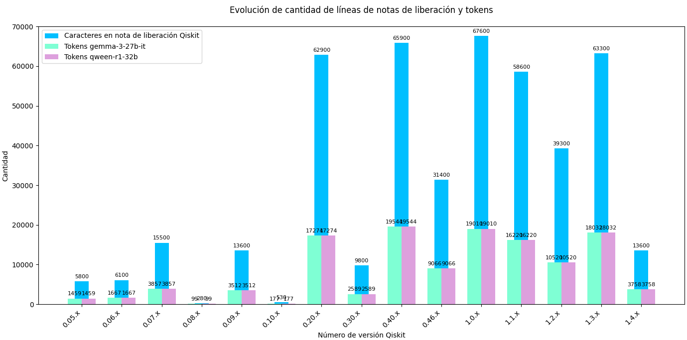

Ejemplo de ejecución del comando:

```python
python ./scrap.py --version "0.46" --invoke_openai true --url_openai_server_endpoint "http://dominio.com:puerto/subdominio" --openai_api_key "modelo" --verificacion true
```

| Version  |  Tamaño  | Cant. líneas | Cant. líneas no vacías | Cant. lineas dif. | Cant. caracteres (k) |Cant. diferencias | estabilidad de datos | # tokens Gemma | # tokens Qween |
| -------: | :------: | -----------: | ---------------------: | ----------------: | -------------------: | ---------------: | :------------------: | -------------: | -------------: |
| 0.05.x | pequeño | 100 | 65 | 64 | 5.8 | 0 | alta | 1459 | 0 |
| 0.06.x | pequeño | 114 | 79 | 25 | 6.1 | 0 | alta | 1667 | 0 |
| 0.07.x | moderado | 183 | 127 | 103 | 15.5 | 0 | alta | 3857 | 0 |
| 0.08.x | pequeño | 12 | 9 | 3 | .28 | 0 | alta | 99 | 0 |
| 0.09.x | moderado | 156 | 141 | 54 | 13.6 | 0 | alta | 3512 | 0 |
| 0.10.x | pequeño | 22 | 17 | 1 | .53 | 0 | alta | 177 | 0 |
| 0.20.x | grande | 766 | 537 | 385 | 62.9 |  7 | alta | 17274 | 0 |
| 0.30.x | pequeño | 122 | 94 | 88 | 9.8 | 0 | alta | 2589 | 0 |
| 0.40.x | grande | 993 | 720 | 387 | 65.9 | 13 | moderada | 19544 | 0 |
| 0.46.x | moderado | 468 | 341 | 299 | 31.4 | 1 | alta | 9066 | 0 |
| 1.0.x | grande | 1020 | 735 | 663 | 67.6 | 1 | alta | 19010 | 0 |
| 1.1.x | moderado | 797 | 565 | 470 | 58.6 | 8 | alta | 16220 | 0 |
| 1.2.x | moderado | 513 | 361 | 297 | 39.3 | 9 | alta | 10520 | 0 |
| 1.3.x | grande | 1019 | 760 | 968 | 63.3 | 24 | moderada | 18032 | 0 |
| 1.4.x | pequeño | 141 | 104 | 27 | 13.6 | 0 | alta | 3758 | 0 |


